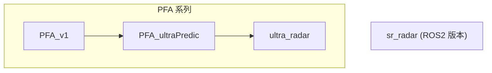

# RoboMaster 雷达站多版本索引

本仓库汇总了多个雷达站实现版本，既包含早期的 PFA 系列，也包含 ROS2 重构版 `sr_radar`，以及最终交付使用的 `ultra_radar`。

如果你是第一次进入这个仓库，建议先看下面这两个入口文档：

- [最终交付版 `ultra_radar` 深度文档](./ultra_radar/PROJECT.md)
- [ROS2 版本 `sr_radar` 深度文档](./sr_radar/PROJECT.md)

## 版本总览

| 目录 | 架构 | 当前定位 | 适合阅读什么 |
| --- | --- | --- | --- |
| `ultra_radar/` | 纯 Python 单进程版本 | 最终交付版本 | 目标检测、盲区预测、串口协议、单目定位、比赛工具链 |
| `sr_radar/` | ROS2 工作区版本 | ROS2 重构版 | 组件化架构、judge bridge、Kalman 跟踪、预警与自动触发 |
| `PFA_ultraPredic/PFA_radar-2025/` | 纯 Python PFA 系列 | 预测增强版 / 中间版本 | 2025 地图适配、盲区预测、滑动窗口与卡尔曼思路 |
| `PFA_v1/PFA_radar-2025/` | 纯 Python PFA 系列 | 基础版 / 早期版本 | 原始 PFA 雷达站思路、基础视觉链路、早期标定流程 |

> 说明：`PFA_ultraPredic` 和 `PFA_v1` 的定位，部分来自目录命名与对应 README 的内容整理。它们都属于 PFA 系列的历史版本，不是当前最终交付版。

## 推荐阅读顺序

如果你想快速理解这套仓库的演进，推荐按下面顺序看：

1. [ultra_radar/PROJECT.md](./ultra_radar/PROJECT.md)
2. [sr_radar/PROJECT.md](./sr_radar/PROJECT.md)
3. [PFA_ultraPredic/PFA_radar-2025/README.md](./PFA_ultraPredic/PFA_radar-2025/README.md)
4. [PFA_v1/PFA_radar-2025/README.md](./PFA_v1/PFA_radar-2025/README.md)

如果你更关心版本演进，可以直接按“历史 -> 现在”顺序看：

1. `PFA_v1`
2. `PFA_ultraPredic`
3. `sr_radar`
4. `ultra_radar`

## 版本关系



可以把它理解为两条线：

- `PFA_v1 -> PFA_ultraPredic -> ultra_radar` 是单目雷达站的 PFA 系列演进线。
- `sr_radar` 是同一业务目标下的 ROS2 架构重写线。

## 目录索引

### `ultra_radar/`

- 深度文档: [ultra_radar/PROJECT.md](./ultra_radar/PROJECT.md)
- 原始说明: [ultra_radar/README.md](./ultra_radar/README.md)
- 关键词: 单目、YOLOv5、TensorRT、盲区预测、串口通信、地图可视化

### `sr_radar/`

- 深度文档: [sr_radar/PROJECT.md](./sr_radar/PROJECT.md)
- 原始说明: [sr_radar/README.md](./sr_radar/README.md)
- 关键词: ROS2、组件化、judge_bridge、Kalman、预警、双倍易伤

### `PFA_ultraPredic/PFA_radar-2025/`

- 原始说明: [PFA_ultraPredic/PFA_radar-2025/README.md](./PFA_ultraPredic/PFA_radar-2025/README.md)
- 关键词: PFA 系列、2025 地图适配、盲区预测、滑动窗口 / 卡尔曼

### `PFA_v1/PFA_radar-2025/`

- 原始说明: [PFA_v1/PFA_radar-2025/README.md](./PFA_v1/PFA_radar-2025/README.md)
- 关键词: PFA 系列、早期版本、基础视觉雷达站

## 使用建议

1. 如果你要找“现在真正交付使用的版本”，看 `ultra_radar/`。
2. 如果你要看“ROS2 版本怎么拆包和通信”，看 `sr_radar/`。
3. 如果你要看“PFA 系列如何从基础版过渡到增强版”，先看 `PFA_v1`，再看 `PFA_ultraPredic`。
4. 不同版本的配置、模型、坐标系和串口协议不能混用，迁移时一定要按各自目录内的 README / PROJECT.md 来看。

## 版本目录速览

```text
.
├── PFA_v1/
├── PFA_ultraPredic/
├── sr_radar/
└── ultra_radar/
```

## 备注

- `ultra_radar` 和 `sr_radar` 都已经整理了更详细的 `PROJECT.md`，适合作为项目主文档。
- `PFA_v1` 和 `PFA_ultraPredic` 保留原始 README，适合作为历史对照和算法演进参考。
- 本仓库是多版本合集，后续如果继续整理，建议在这里继续维护统一索引，而不要在不同版本目录里各自“自说自话”。
