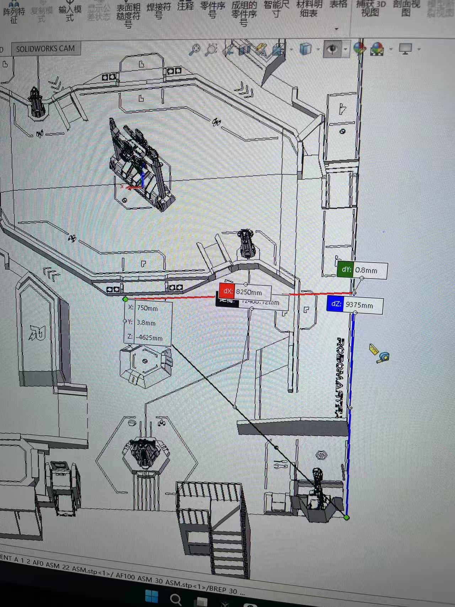
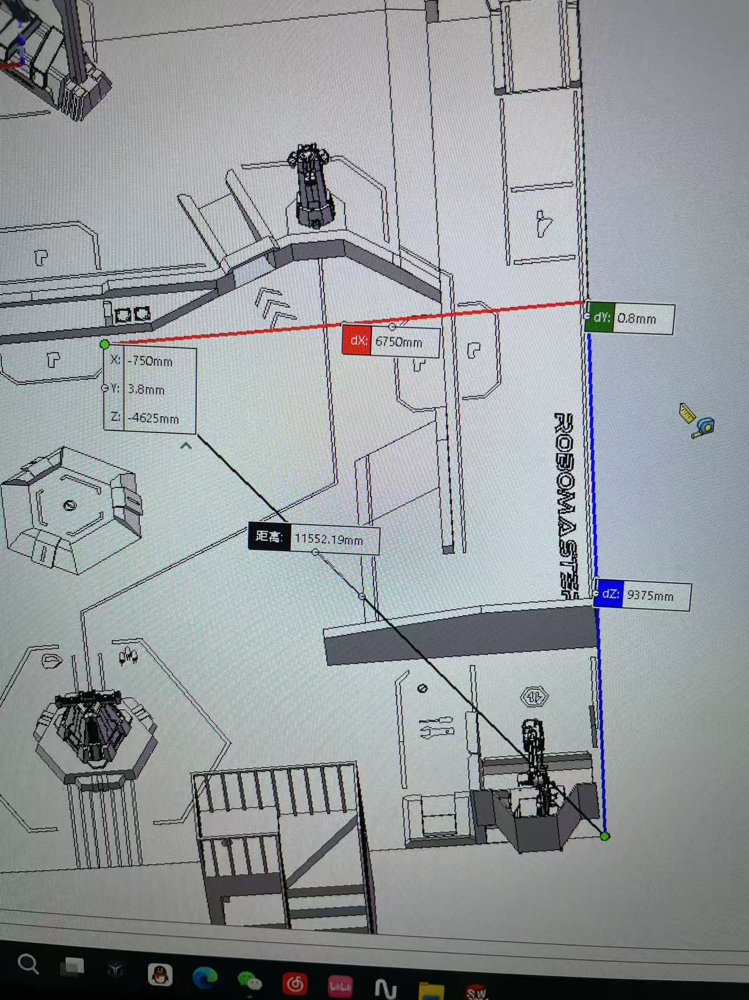
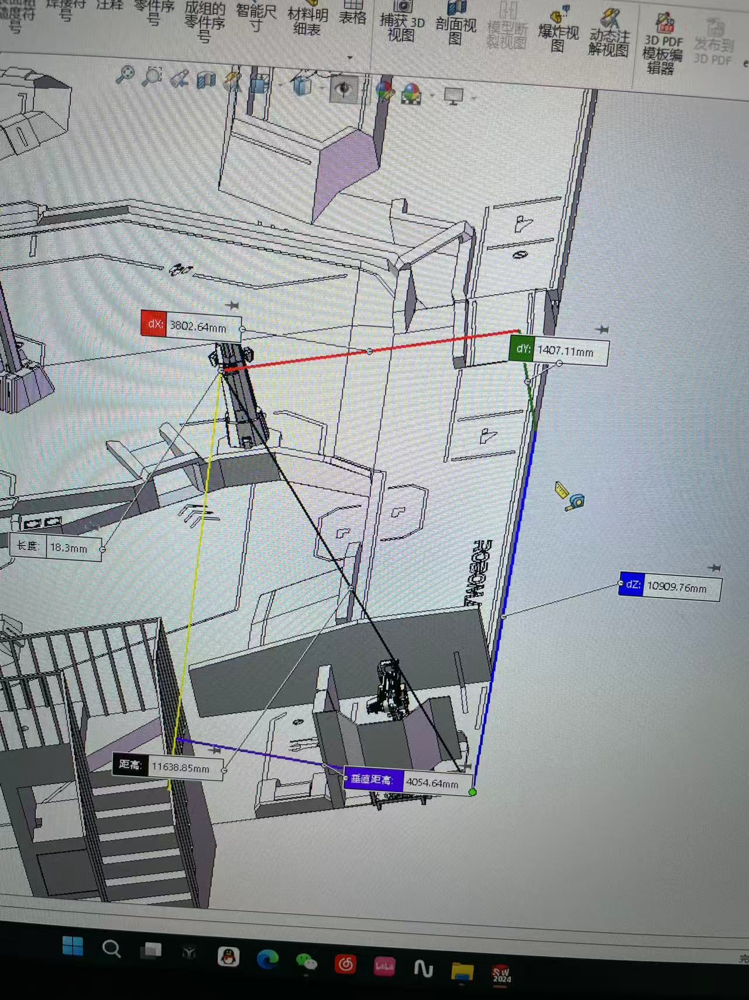
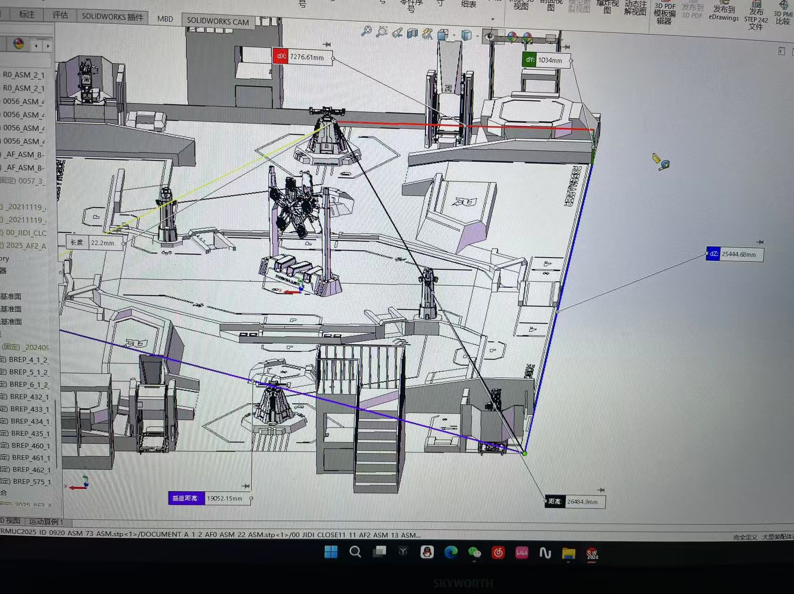
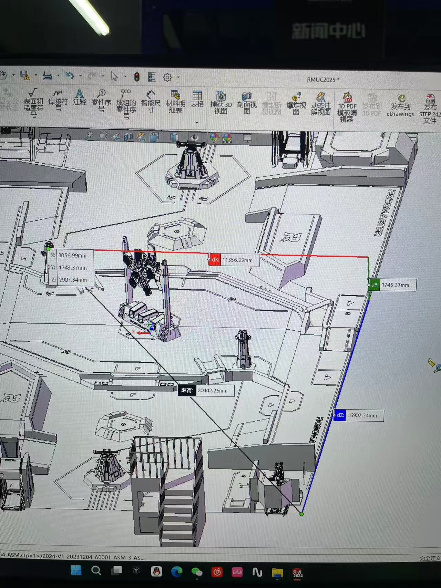
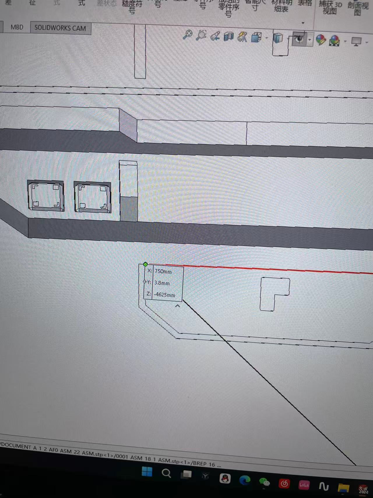
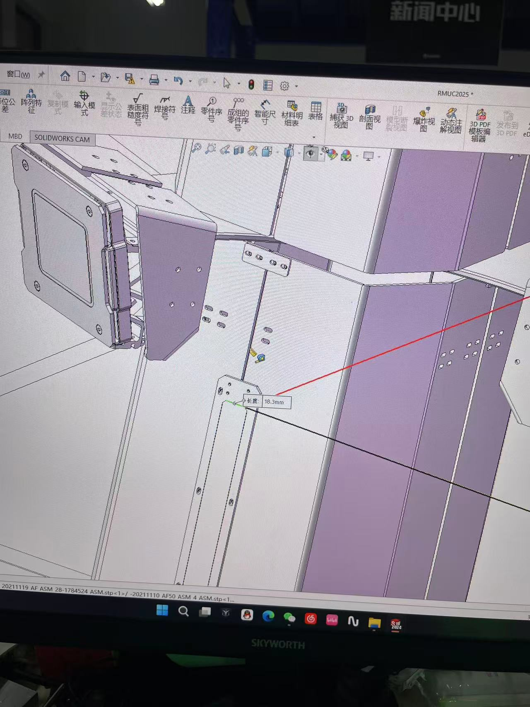
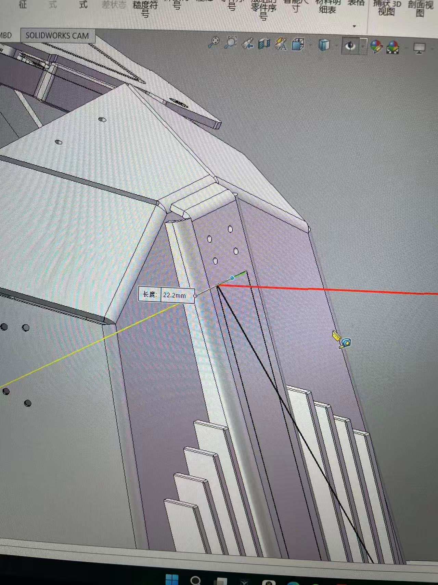

<div align="center">

# SR Radar 2025

# # 版本和发布记录

**v0.0.1beta**

- 初始化仓库，加入基础内容，初版README

**v1.0**

- 加入开源技术报告链接

**v1.1**

- TensorRT 10 API 支持
- Ubuntu 24.04 支持 (Jazzy分支)
- 删除rosbag_player包，改用 [rosbag2](https://github.com/ros2/rosbag2/tree/jazzy?tab=readme-ov-file#using-with-composition) 进程内通信 (Jazzy分支)

# 项目介绍

**如果你没有激光雷达，也可以直接使用本项目的单目相机方案 (在RM2023的0.6m误差规则下取得了最高91%的准确率，荣获2023年雷达MVP)**

## 项目优势

- 1.即插即用，不依赖联合标定，脱离空间(机械结构)上的限制

- 2.不依赖相机和雷达之间的帧间匹配，脱离时间上的限制

- 3.直接使用直角坐标系的信息，更加直观

- 4.三层神经网络实现了更好的鲁棒性和可修复性，极大地降低了模型训练和数据集整理的难度和时间。

- 5.低耦合，易于维护和扩展

- 6.雷达全自动配准，节约3分钟部署时间

## 硬件条件

- 海康工业相机/USB直驱相机

- USB串口（另一头需接裁判系统user串口）

- 有GPU的运算端，推荐RTX3060以上

- 推荐配置：相机MV-CS060-10UC-PRO（USB款），镜头5-12ｍｍ（6ｍｍ最佳）

## 项目结构说明

**本项目提供了除串口、相机驱动、模型训练外雷达站的全部功能**

### 单目相机

- 五点标定(键盘微调)
- 透视变换方案

### 识别

- 两层神经网络结构

| 名称      | 大小      | 用途    |
| ------- | ------- | ----- |
| yolov5s | 640x640 | 识别机器人 |
| yolov5s | 640x640 | 识别装甲板 |

建议根据相机分辨率调整模型大小，以提高推理速度。

- RTX A4000 实测50Hz
- RTX 3050M (35W极致阉割版) 实测16Hz

由于使用了时间同步，只要推理速度>10Hz 也能正常使用。

**模型存储在 model/ONNX 文件夹下**

- 提供了onnx自动转换trt，如果没有检测到TensorRT编译的模型，会自动编译对应模型。

### 

### 传感器融合

- ### 工具包

- 进程内播放rosbag (ros2 jazzy已支持)

## 模块介绍

| 模块                                        | 说明          |
| ----------------------------------------- | ----------- |
| [`camera`](./src/tdt_vision/)             | 相机模块（无相机驱动） |
| [`interface`](./src/interface/)           | 自定义消息接口     |
| [~~`llm_decision`~~](./src/llm_decision/) | ~~大模型决策模块~~ |
| [`livox_driver`](./src/livox_driver/)     | Livox驱动     |
| [`fusion`](./src/fusion/)                 | 传感器后融合模块    |
| [`utils`](./src/utils/)                   | 工具包         |

## 依赖

```bash
Ubuntu 22.04
ROS2 (Humble)
CUDA+CUDNN+TensorRT(≥8)
OpenCV 4.5.4
PCL 1.12.1
Livox_SDK(1)
```

如果您使用的是g++-12, 希望使用clang和clangd, 请确保安装了以下包:

```bash
sudo apt-get install libstdc++12-dev
```

## 进程间通信消息名称及用途

### 1. ROS2 通信 （注意QoS）

#### 相机

| 名称             | 类型                                           | 用途     |
| -------------- | -------------------------------------------- | ------ |
| camera_image   | topic< sensor_msgs::msg::Image >             | 相机驱动接口 |
| detect_result  | topic< vision_interface::msg::DetectResult > | 识别结果   |
| resolve_result | topic< vision_interface::msg::DetectResult > | 解算结果   |

#### 传感器融合

| 名称            | 类型                                         | 用途        |
| ------------- | ------------------------------------------ | --------- |
| kalman_detect | topic<vision_interface::msg::DetectResult> | 卡尔曼节点输出   |
| match_info    | topic<vision_interface::msg::MatchInfo >   | 当前比赛的实时信息 |

## 工具

可用VSCode使用Ctrl+Shift+B使用常见编译任务(需安装工作区推荐插件)，例如下方指令为编译单个包指令，已集成进tasks.json

```bash
colcon build --packages-select 功能包名称
```

已实现VSCode下使用gdbserver或lldb-server进行程序调试的配置文件，按下F5即可使用，需安装相应插件

## 测试

```bash
ros2 launch tdt_vision run_camera.launch.py #订阅相机画面，启动雷达
ros2 launch tdt_vision run_rosbag_player.launch.py #2025东部赛区rosbag detect节点订阅camera_image话题
ros2 launch tdt_vision run_video.launch.py #2025东部赛区mp4，detect节点订阅video_image
ros2 run debug_map debug_map #启动地图可视化
```

测试ros2bag下载
[百度网盘](https://pan.baidu.com/s/1ogRvs3v1OMCVUbAlUsOGQA?pwd=52rm)

修改tdt_vision/launch对应的launch文件中的rosbag路径即可进程内播放对应的rosbag

### 相机外参标定

```bash
ros2 launch tdt_vision calib_rosbag.launch.py #订阅相机画面进行标定
ros2 launch tdt_vision calib_video.launch.py #启动video_streamer_node对mp4画面进行标定，测试用
```

按Enter键开始标定,按照以下图片顺序依次点击赛场对应的真实点

<p align="center">
  
  <br>
  <em>标定点1</em>
</p>

<p align="center">
  
  <br>
  <em>标定点2</em>
</p>

<p align="center">
  
  <br>
  <em>标定点3</em>
</p>

<p align="center">
  
  <br>
  <em>标定点4</em>
</p>

<p align="center">
  
  <br>
  <em>标定点5</em>
</p>

<p align="center">
  
  <br>
  <em>标定细节1</em>
</p>

<p align="center">
  
  <br>
  <em>标定细节2</em>
</p>

<p align="center">
  
  <br>
  <em>标定细节3</em>
</p>

每次点击后可使用wasd调节上下左右，按n键保存当前点，保存5个点后自动计算外参并保存在config/out_matrix.yaml

## 可视化

Launch文件已集成foxglove-bridge,启动后直接打开foxglove-studio即可查看

## TODO

- 多相机/雷达从当前逻辑(结构)上可以实现，但是并没有进行对应ros2接口的适配

- 改进聚类算法

- 使用ros参数，实时调参
  
  # 联系方式
  
  Email: shenxuewen0127@gmail.com

QQ: 2738226430

</div>
