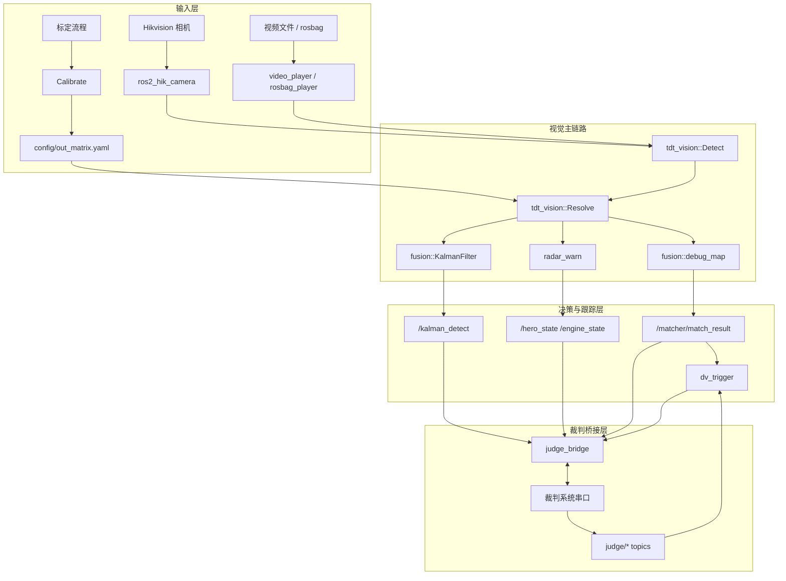

# sr_radar 项目文档

> 说明：本文档基于当前仓库根目录下的 `sr_radar/` 代码树整理。这个版本是 ROS2 工作区实现，主线围绕相机检测、坐标解算、告警、双倍易伤触发和裁判系统串口桥接展开。仓库 README 仍保留了上一阶段关于激光雷达融合的总述，但当前 root 代码树中未发现对应的 `lidar/` 源码目录，因此本文以实际存在的代码为准，不对缺失源码做臆测。

## 1. 项目概述

`sr_radar` 是一个 ROS2 雷达站工作区，拆分为多个职责明确的 package，通过 topic、service 和 component node 协作完成整条雷达算法流水线。和 `ultra_radar` 的“单体 Python 工程”不同，它采用的是标准 ROS2 架构：

1. 相机驱动节点负责采集图像。
2. `tdt_vision` 负责目标检测、解算和标定。
3. `fusion` 下的节点负责后处理、跟踪和地图展示。
4. `judge_bridge` 负责裁判系统串口收发。
5. `dv_trigger` 根据比赛状态自动触发双倍易伤。
6. `radar_warn` 根据敌方状态输出英雄 / 工程预警。



## 2. 技术栈与版本

### 2.1 平台与基础依赖

| 类别 | 版本 / 说明 |
| --- | --- |
| 操作系统 | Ubuntu 22.04（README 说明） |
| ROS2 | Humble（README 说明） |
| C++ 标准 | 按 package 不同：`tdt_vision` 使用 C++20，`ros2_hik_camera` 使用 C++14，其余主 package 多为 C++17 |
| OpenCV | `4.5.4`（README 说明） |
| PCL | `1.12.1`（README 说明） |
| TensorRT | README 说明 `>= 8`，但当前 `tdt_vision/CMakeLists.txt` 实际硬编码到 `10.7.0.23` |
| CUDA | 当前 `tdt_vision/CMakeLists.txt` 指向 `12.4` |
| Hikvision SDK | `ros2_hik_camera` 使用海康相机 SDK，按 `amd64` / `arm64` 分库 |
| Boost | `judge_bridge` 使用 `locale` / `date_time` / `filesystem` / `iostreams` / `asio` |
| Eigen3 | `tdt_vision` 和 PnP / 轨迹处理使用 |
| ament | `ament_cmake`、`ament_cmake_auto`、`rclcpp_components` |

### 2.2 版本差异提示

这份 workspace 存在一个非常重要的“文档版本差异”：

1. README 介绍的是较完整的 T-DT 2024 Radar 总体架构。
2. 当前 root 代码树更接近“相机雷达 + 裁判桥 + 预警 + 后融合”的实现。
3. `tdt_vision/CMakeLists.txt` 中的 TensorRT / CUDA 路径是固定环境路径，需要迁移后手动修改。

因此在部署时不能只看 README，必须同时检查实际 CMake 和配置文件。

## 3. Workspace 与 Package 分工

| Package | 作用 |
| --- | --- |
| `tdt_vision` | 视觉主链路，包含检测、解算、标定 |
| `judge_bridge` | 裁判系统串口桥接、裁判消息解码与回传 |
| `dv_trigger` | 双倍易伤自动触发 |
| `radar_warn` | 英雄 / 工程机器人预警 |
| `fusion/kalman_filter` | 英雄机器人卡尔曼跟踪 |
| `fusion/debug_map` | 地图可视化与 `MatchResult` 组装 |
| `interface/vision_interface` | 视觉层消息接口 |
| `radar_interface` | 雷达 / 裁判 / 融合消息接口 |
| `ros2_hik_camera` | 海康相机 ROS2 驱动 |
| `utils/video_streamer_cpp` | 视频文件播流 |
| `utils/video_player` | 视频 / 摄像头播流 |
| `utils/video_recorder` | 图像话题录制 |
| `utils/rosbag_player` | rosbag 离线回放 |
| `radar_decision` | 当前仅有 package 壳，没有实际源码 |

## 4. 消息契约

### 4.1 `vision_interface`

| Message | 字段 | 用途 |
| --- | --- | --- |
| `DetectResult` | `header`, `blue_x[6]`, `blue_y[6]`, `red_x[6]`, `red_y[6]` | 检测和解算后的基础输出 |
| `RadarWarn` | `dart_state`, `fly_state`, `engine_state`, `hero_state` | 预警状态输出 |
| `Radar2Sentry` | `radar_enemy_x[6]`, `radar_enemy_y[6]` | 发给哨兵的敌方坐标 |
| `Sentry2Radar` | `self_x[6]`, `self_y[6]` | 哨兵回传坐标 |
| `RadarDecision` | `x`, `y`, `z` | 决策输出 / 占位接口 |
| `MatchInfo` | `self_color`, `match_time`, `robot_hp`, `marks`, `ultimate`, `eventtype` | 裁判比赛信息快照 |
| `Message` | `sender_id`, `receiver_id`, `user_data[30]` | 通用消息封装 |

### 4.2 `radar_interface`

| Message | 字段 | 说明 |
| --- | --- | --- |
| `MatchedTarget` | `id`, `position[2]` | 单个匹配目标 |
| `MatchResult` | `blue[6]`, `red[6]` | 匹配后的阵营目标数组 |
| `Target` / `TargetArray` | 目标状态、速度、协方差 | 更完整的跟踪状态接口 |
| `Armor` | 装甲板类型、颜色、置信度、关键点 | 检测结果结构 |
| `GameRobotHP` | 双方机器人 HP | 裁判回包解析结果 |
| `RadarInfo` | `dv_chances`, `dv_triggered` | 双倍易伤状态 |
| `RadarMarkData` | `mark_progress[6]` | 标记进度，范围 0-120 |
| `RadarCmd` | `dv_used`, `dv_total` | 交互命令接口，当前主链路实际使用的是 `std_msgs::msg::UInt8` 简化命令，`.msg` 作为保留契约 |
| `MapCommand` | `target_position_x`, `target_position_y`, `cmd_keyboard`, `target_robot_id`, `cmd_source` | 地图键盘 / 点位命令 |
| `MapRobotData` | `target_robot_id`, `target_position_x`, `target_position_y` | 地图坐标发送结构 |
| `UwbData` | 机器人坐标组 | UWB 兼容接口 |

### 4.3 阵营枚举

`team_color.hpp` 定义：

| 值 | 含义 |
| --- | --- |
| `C_BLUE = 0` | 蓝方 |
| `C_RED = 1` | 红方 |
| `UNKNOWN = 2` | 未知 |

代码中 `std_msgs::msg::Bool` 被复用为阵营消息载体，`false` 表示蓝，`true` 表示红。

## 5. 模型、推理与训练

### 5.1 模型资产

当前仓库中的模型文件主要在 `sr_radar/model/ONNX/`：

| 文件 | 说明 |
| --- | --- |
| `RM2024.onnx` | 车体检测网络 |
| `armor_yolo.onnx` | 装甲板检测网络 |
| `armor.onnx` | 装甲板网络的另一份导出 |
| `classify.onnx` | 分类器导出文件 |

`tdt_vision` 的运行时是 TensorRT 引擎优先，engine 缺失时会自动从 ONNX 生成。

`config/detect_params.yaml` 里还保留了 `classify_path` 字段，但当前 `Detect` 节点只读取 `yolo_path` 和 `armor_path`，分类器尚未接入主线。

### 5.2 训练侧的实际含义

这套 workspace 没有把训练入口直接放出来，但工程结构仍然很明确：

1. 检测模型使用 YOLO 系列。
2. 分类模型使用单独的 TensorRT wrapper。
3. 训练产物通过 ONNX 再进入 TensorRT。

README 中给出的“三层网络”是：

| 层级 | 输入尺寸 | 作用 |
| --- | --- | --- |
| YOLOv5s | `1280x1280` | 机器人检测 |
| YOLOv5s | `192x192` | 装甲板检测 |
| ResNet18 / 分类器 | `224x224` | 数字分类 |

但就当前代码树而言，`Detect` 节点实际只加载并使用了前两层：`yolo.engine` 与 `armor.engine`。`classify.onnx` 与 `classify::Infer` 的封装仍在仓库中，但没有接入当前 detect callback。

### 5.3 TensorRT 推理封装

`sr_radar/src/tdt_vision/yolo/` 下保存了完整的 TRT 运行时封装，关键点是：

1. `trt::load()` 负责加载并反序列化 engine。
2. `yolo::load()` 和 `classify::load()` 负责把 engine 包装成统一 `Infer` 接口。
3. 预处理在 GPU 上做仿射变换、缩放和归一化。
4. 推理通过 `enqueueV3` 走 TensorRT execution context。

`yolo::Type` 目前支持 `V5`, `V7`, `V8`, `V8Seg` 等多种模型类型，但当前检测节点使用的是 `V5` 分支。

### 5.4 `Detect` 节点的推理流程

`tdt_vision::Detect` 的工作顺序如下：

1. 读取 `./config/detect_params.yaml` 中的 engine 路径。
2. 如果 engine 不存在，自动调用 `src/utils/onnx2trt.py` 生成。
3. 加载 `yolo.engine` 作为主车体检测器。
4. 加载 `armor.engine` 作为装甲板检测器。
5. 接收 `video_image` 话题。
6. 对整帧做车体检测。
7. 对每个车体 ROI 再做装甲板检测。
8. 用最高置信度装甲板决定机器人编号和颜色。
9. 输出 `vision_interface::msg::DetectResult`。

车体检测的筛选规则是：

1. `result.size() == 0` 时直接发布空结果。
2. `result.size() > MAX_CARS` 时也直接丢弃。
3. 只保留 class_label 为 `0` 或 `1` 的车体框。

装甲板编号映射规则是：

1. `0-5` -> 蓝方，编号 `1-6`。
2. `6-11` -> 红方，编号 `1-6`。

### 5.5 `classify` 的状态

仓库中保留了 `classify.hpp`、`classify.cu` 和 `classify.onnx`，说明项目曾经或计划支持额外的数字分类器。当前代码树的实际在线链路没有调用它，所以文档层面应把它视作“保留能力”而不是“已接入主链路”。

## 6. 目标检测的后处理细节

`Detect` 节点把车体框裁剪后再送给装甲板网络，装甲板网络返回后按以下规则更新结果：

1. 取该车里置信度最高的装甲板作为有效编号。
2. 车体中心点不是几何中心，而是使用车体底边中点。
3. `DetectResult` 中同阵营同编号位置不为空时即写入坐标。

这种设计有两个优点：

1. 装甲板号识别只在车体局部区域做，误检更少。
2. 最终坐标更接近机器人脚点，方便后续地图定位。

## 7. 标定与定位

### 7.1 `calibrate` 节点

`tdt_vision::Calibrate` 是一个 ROS2 component 节点，负责把图像坐标与战场世界坐标建立映射。它支持两种模式：

1. 手动点选 + `solvePnP`。
2. 棋盘格自动角点模式。

默认模式是手动点选。流程是：

1. 读取 `config/camera_params.yaml` 的相机内参和畸变参数。
2. 点击图像中的真实点位。
3. 点击地图对应点位。
4. 按 `n` 完成单点确认。
5. 收集 5 个世界点后运行 `cv::solvePnP(EPNP)`。
6. 输出 `config/out_matrix.yaml` 中的 `world_rvec` 与 `world_tvec`。

### 7.2 `radar_utils`

`Parser_Points` 和 `parser` 是定位链路的核心工具。它们做了两件事：

1. 从 `config/RM2025_Points.yaml` 读取每个战区区域的 3D 多边形。
2. 根据当前相机外参把这些 3D 多边形投影到图像平面，形成高度判定区域。

`parser` 初始化时会加载：

| 文件 | 作用 |
| --- | --- |
| `config/camera_params.yaml` | 相机内参 |
| `config/out_matrix.yaml` | 相机外参 |
| `config/RM2025_Points.yaml` | 战区多边形和高度定义 |

### 7.3 高度分段映射

当前实现把地图分为几类高度区：

| 区域 | 高度 |
| --- | --- |
| `Center_Highland` | `0.3` |
| `Self_Highland` / `Enemy_Highland` | `0.6` |
| `Right_Road` / `Left_Road` | `0.2` |
| `Self_Fortress` / `Enemy_Fortress` | `0.15` |

`parser::parse()` 的关键逻辑是：

1. 先用点是否落在多边形中判断高度。
2. 再调用 `get_2d()` 将图像点投影到目标高度平面。
3. `get_2d()` 内部先构造一个带高度的世界矩形，再用 `projectPoints` 生成图像上的参考四边形。
4. 最后通过 `getPerspectiveTransform` 把输入点转成世界坐标。

这是一种“按区域分段的平面投影”方案，不是单一全局平面，因此对高地、路面、堡垒等不同高度层更稳健。

### 7.4 `Resolve` 节点

`Resolve` 订阅 `detect_result`，对每个机器人分别执行：

1. 取出蓝方点或红方点。
2. 调用 `parser_->parse()`。
3. 再给 `y` 加上 `15` 的场地偏移。
4. 发布到 `/resolve_result`。

也就是说，`Resolve` 做的是“图像坐标 -> 场地坐标”的正式落地。

## 8. 滤波、跟踪与预警

### 8.1 `Kalman_filter_plus`

`fusion/kalman_filter/include/filter_plus.h` 中定义了单个目标的卡尔曼状态，状态向量是：

```text
[x, vx, y, vy]
```

关键参数包括：

| 参数 | 说明 |
| --- | --- |
| `delete_time` | 超时删除阈值，默认 `2.0` 秒 |
| `max_history` | 历史长度上限，默认 `20` |
| `car_speed` / `car_max_speed` | 运动速度假设 |
| `sigma_q_x` / `sigma_q_y` | 过程噪声 |
| `sigma_r_x` / `sigma_r_y` | 观测噪声 |

它还维护了两个历史队列：

1. `history`：点位历史。
2. `detect_history`：颜色与编号的历史，用于投票决定目标身份。

### 8.2 `KalmanFilter`

`fusion/kalman_filter/src/kalman_filter.cpp` 中的节点只重点跟踪英雄机器人索引 `0`：

1. 先让所有滤波器做预测。
2. 如果新的英雄坐标出现，按预测距离做匹配。
3. 无匹配就新建滤波器。
4. 单匹配直接更新。
5. 多匹配时选择最近的那个更新。
6. 超过 `1.5s` 的滤波器会被清理。
7. 最终把预测点写回 `DetectResult`，发布到 `/kalman_detect`。

当己方颜色为蓝方时，结果会做 `28 x 15` 的对称翻转，保证输出坐标与当前己方视角一致。

### 8.3 `RadarWarn`

`radar_warn` 是一个状态驱动的预警节点，它维护两类预警：

1. 英雄机器人预警：基于短时间内的静止 / 低移动行为。
2. 工程机器人预警：基于是否持续停留在中心高地。

关键策略是：

1. 订阅 `/resolve_result` 和 `/detect_result`。
2. 通过 `parser_->isPointInCenterHighland()` 判断工程机器人是否进入中心高地。
3. 使用历史窗口判断英雄机器人是否在 `2.5s` 内几乎没有移动。
4. 以 `vision_interface::msg::RadarWarn` 发布 `hero_state` 和 `engine_state`。

`RadarWarn` 的行为非常像一个小型状态机，而不是简单的阈值函数。

它实际使用的关键窗口参数是：

| 参数 | 默认值 | 说明 |
| --- | --- | --- |
| `hero_history_duration` | `2.5` 秒 | 英雄历史窗口 |
| `min_movement_threshold` | `0.2` 米 | 英雄“显著移动”判定阈值 |
| `engine_in_area_duration` | `1.0` 秒 | 工程在中心高地持续多久触发预警 |
| `engine_out_area_duration` | `0.5` 秒 | 工程离开中心高地多久解除预警 |

## 9. 双倍易伤触发

`dv_trigger` 的职责是根据比赛状态自动决定是否向裁判系统发送双倍易伤命令。它订阅的消息包括：

| 话题 | 作用 |
| --- | --- |
| `judge/radar_info` | 读取双倍易伤机会和当前触发状态 |
| `judge/color` | 获取己方阵营 |
| `matcher/match_result` | 计算前压机器人数量 |
| `judge/remain_time` | 依据比赛剩余时间决定强制触发 |
| `judge/game_robot_hp` | 判断是否处于战斗状态 |
| `judge/radar_mark_data` | 判断是否已经进入高亮阶段 |

默认参数为：

| 参数 | 默认值 |
| --- | --- |
| `time_force_trigger` | `80` |
| `cross_bots_trigger` | `1` |
| `hp_diff_trigger` | `10` |
| `hp_diff_ticks` | `3` |
| `keyboard_trigger` | `'L'` |
| `dv_check_time` | `5` |
| `dv_max` | `2` |

触发逻辑分三层：

1. 时间接近结束时强制触发。
2. 处于战斗状态并且标记高亮时，如果有机器人跨过半场则触发。
3. 若裁判系统已经给出双倍易伤机会，则等待状态确认再统计使用次数。

需要注意的是，`dv_trigger.hpp` 里保留了 `sub_key`，但当前 `dv_trigger.cpp` 没有真正把键盘触发接进来，所以“手动键盘触发”在这份代码树里属于保留接口。

## 10. 裁判系统桥接

### 10.1 `judge_bridge`

`judge_bridge` 是整个 ROS2 工作区里最关键的协议适配层。它的职责是：

1. 通过串口读取裁判系统原始帧。
2. 按 `CMD_ID` 分发解析。
3. 发布统一的 ROS2 主题。
4. 将来自视觉和融合节点的结果重新封包，写回裁判系统。

`JudgeSerial` 使用了：

1. `boost::asio` 做串口 I/O。
2. CRC8 / CRC16 校验。
3. 可选的原始串口录制，落到 `./serial_recorder/*.raw`。

### 10.2 解析到的裁判消息

`filter_handler()` 目前处理的核心帧包括：

| CMD | 含义 |
| --- | --- |
| `DETECT_PROCESS (0x020C)` | 雷达标记进度 |
| `RADAR_INFO (0x020E)` | 双倍易伤机会 / 触发状态 |
| `ROBOT_STATUS (0x0201)` | 阵营与雷达 ID |
| `GAME_STATUS (0x0001)` | 比赛阶段与剩余时间 |
| `GAME_ROBOT_HP (0x0003)` | 双方机器人 HP |

### 10.3 发送回裁判系统

当前实际发送到 `judge/radar_cmd` 的 payload 是 `std_msgs::msg::UInt8`，而不是 `radar_interface::msg::RadarCmd`；后者保留为消息契约。

`judge_bridge` 会把多个上层节点的结果重新封包发送：

| 发送函数 | 目标 |
| --- | --- |
| `send_radar_cmd()` | 双倍易伤触发请求 |
| `send_map_robot_data()` | 地图上的机器人坐标 |
| `send_sentry_data()` | 工程机器人状态给哨兵 |
| `send_standard1_data()` / `send_standard2_data()` | 英雄状态给标准步兵 |

其中 `send_map_robot_data()` 会把 `MatchResult` 中的坐标乘以 `100` 后转成裁判系统单位。

## 11. 地图可视化与离线调试

### 11.1 `debug_map`

`fusion/debug_map` 主要做两件事：

1. 把 `/resolve_result` 转成 `radar_interface::msg::MatchResult`。
2. 在 `config/RM2025.png` 上做实时显示。

它并不做复杂的匹配算法，更多是一个“桥接 + 可视化”节点。

### 11.2 视频 / rosbag 工具

| 工具 | 作用 |
| --- | --- |
| `video_streamer_cpp` | 从视频文件播流到 ROS topic |
| `video_player` | 从摄像头或视频播流到 `video_image` |
| `video_recorder` | 录制图像 topic 为 MP4 |
| `rosbag_player` | 从 rosbag 读取 `/livox/lidar`、`/compressed_image`、`/match_info` 并重放 |

`run_rosbag.launch.py` 会把 `judge_bridge`、`radar_warn`、`dv_trigger`、`rosbag_player`、`foxglove_bridge`、`radar_detect`、`radar_resolve` 组合起来，适合离线复盘。
`run_camera.launch.py` 用 `hik_camera` + `Calibrate` 构成实时标定链路。
`calib_rosbag.launch.py` 则是用 rosbag 回放配合相机标定，适合离线对齐外参。
需要注意的是，`Detect` 当前订阅的是 `video_image`，而 `rosbag_player` 默认发布的是 `rosbag_image`，离线回放时通常需要在 launch 或 remap 层补一个话题适配。

### 11.3 `ros2_hik_camera`

相机驱动节点直接读取海康工业相机，发布 `camera_image` 和对应 `CameraInfo`。它支持的关键参数包括：

| 参数 | 作用 |
| --- | --- |
| `exposure_time` | 曝光 |
| `frame_rate` | 帧率 |
| `gain` | 增益 |
| `camera_name` | 相机名 |
| `camera_info_url` | 标定信息路径 |

节点内部使用 `image_transport::CameraPublisher`，并在采集线程里做 Bayer 到 RGB8 的转换，再转成 BGR8 发布。

## 12. 工程设计模式

`sr_radar` 的架构体现了比较典型的 ROS2 工程范式：

1. 组件化：`tdt_vision`、`KalmanFilter`、`Calibrate` 等都用 component node 方式注册。
2. 发布/订阅解耦：每个功能只关心自己的输入输出 topic。
3. 协议适配层：`judge_bridge` 把裁判协议和 ROS2 解耦。
4. 状态机模式：`dv_trigger`、`RadarWarn` 都依赖历史窗口和状态机判断。
5. 防御式启动：相机、串口、engine 缺失时会尝试自动恢复或自动生成。
6. 参数驱动：启动文件和节点参数决定运行模式，减少硬编码。

## 13. 已知注意事项

1. `tdt_vision/CMakeLists.txt` 中的 TensorRT / CUDA 路径是强环境绑定，迁移机器时必须修改。
2. `config/detect_params.yaml` 中的 engine 路径仍然是旧机器的绝对路径，需要迁移后更新。
3. `radar_decision` 目前只是 package 壳，没有源码。
4. `dv_trigger` 的键盘触发接口保留了但未接通。
5. `classify` 模块和 `OCSort` 依赖仍在仓库中，但当前 detect 主链路并没有把它们接入。
6. README 中提到的激光雷达融合链路，在当前 root tree 里没有对应源码，不建议把它当成已经可运行的当前实现。
