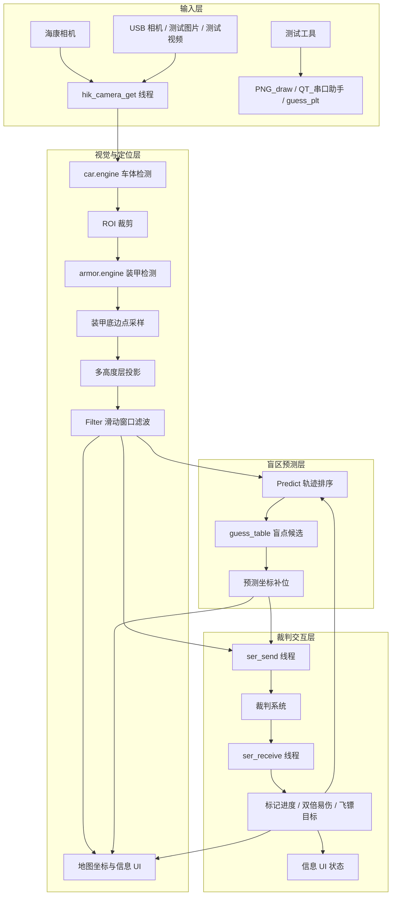

# ultra_radar 项目文档

> 说明：本文档基于当前仓库中的 `ultra_radar/` 实际源码、配置、模型产物和 README 整理。`ultra_radar` 是最终交付使用的单目雷达站版本，核心目标是在不依赖 ROS 的前提下完成目标检测、坐标解算、盲区预测、串口通信和界面可视化。

## 1. 项目概述

`ultra_radar` 是成都大学 Ultra 战队 2025 赛季的单目雷达站实现。它继承了上一版 PFA 雷达站的“纯视觉 + 低耦合 + 可配置”思路，并针对 2025 地图、裁判协议、串口交互、盲区排序和测试流程做了重新整理。

这个版本的核心特点是：

1. 采用两级目标检测，先找车，再在车 ROI 内找装甲板。
2. 通过多高度层透视矩阵，将像素坐标映射到战场坐标。
3. 通过滑动窗口滤波和盲区预测补齐短时丢检。
4. 通过串口直接与裁判系统交互，既能发送坐标，也能读取标记进度、双倍易伤状态和飞镖目标。
5. 带有完整的测试工具链，方便在没有正式比赛设备时做离线验证。

## 2. 技术栈与版本

### 2.1 运行与依赖

| 类别 | 版本 / 说明 |
| --- | --- |
| Python | 仓库未显式固定版本，按当前依赖与工程惯例使用 Python 3 |
| PyTorch | `2.5.0+cu121` |
| Torchvision | `0.20.0+cu121` |
| ONNX | `1.16.1` |
| ONNX Runtime | `1.14.1` |
| OpenCV | `4.5.5.64` |
| NumPy | `1.26.4` |
| PyQt5 | `5.15.11` |
| Matplotlib | `3.5.2` |
| Pandas | `1.1.5` |
| Seaborn | `0.11.2` |
| Pillow | `9.5.0` |
| tqdm | `4.64.0` |
| requests | `2.27.1` |
| Flask | `2.2.3` |
| pyserial | `3.5` |
| TensorRT | README 建议优先使用 `8.6.1` |
| 相机 SDK | 海康 `MvImport` / `MvImport_Linux`，版本未在仓库中固定 |

### 2.2 运行环境

README 中给出的开发环境是 Windows 11 24H2 + i5-12500H + RTX 3050(4GB) + CUDA 12.1。代码本身是跨平台风格，但相机 SDK、TensorRT、串口号、文件路径都需要按本机环境调整。

## 3. 目录与职责

| 文件 / 目录 | 作用 |
| --- | --- |
| `main.py` | 主程序入口，负责加载模型、启动相机/串口线程、主循环推理和显示 |
| `detect_function.py` | YOLOv5 TensorRT / ONNX 推理封装 |
| `calibration.py` | PyQt5 标定工具，生成多高度层透视矩阵 |
| `RM_serial_py/ser_api.py` | 裁判系统串口打包、解析、CRC 校验 |
| `hik_camera.py` | 海康相机 Python 封装 |
| `onnx2engine.py` | 将 ONNX 转成 TensorRT `.engine` |
| `export.py` | 复用 YOLOv5 上游导出能力 |
| `models/` | YOLOv5 运行时源码、ONNX 模型、TensorRT 引擎 |
| `yaml/` | 数据集配置文件 |
| `images/` | 地图、掩码、调试图资源 |
| `information_ui.py` | 进度条与裁判状态 UI 绘制 |
| `PNG_draw.py` | 地图 / 掩码绘制工具 |
| `RMUC_axis.py` | 盲区坐标标注与可视化工具 |
| `guess_plt.py` | 盲点优先级测试脚本 |
| `QT_串口助手.py` | 模拟裁判系统 / 串口调试工具 |

## 4. 系统架构

`ultra_radar` 是一个单进程、线程化的视觉雷达站。主线程负责帧级推理和 UI 绘制，后台线程负责相机采集和串口收发。



工程上没有引入 ROS，而是直接使用 Python 线程 + OpenCV + serial + TensorRT 来完成在线闭环。

## 5. 运行配置

`main.py` 顶部集中管理了最重要的运行参数，典型值如下：

| 参数 | 作用 |
| --- | --- |
| `state` | 阵营，`R` 红方或 `B` 蓝方 |
| `USART` | 是否开启串口 |
| `user_com` | 串口号 |
| `user_mode` | 图像来源，`test` / `hik` / `video` |
| `user_map` | 2025 地图资源 |
| `user_img_test` | 测试图片或视频 |
| `user_ExposureTime` | 海康相机曝光 |
| `user_Gain` | 海康相机增益 |
| `save_img` | 是否录制地图 / 原图 / UI |
| `game_dir` | 录像子目录 |
| `d_factor` | 盲点优先级中的距离衰减系数 |
| `cos_factor` | 盲点优先级中的余弦相似度系数 |

仓库中的地图和掩码主要是：

| 资源 | 作用 |
| --- | --- |
| `images/2025map.png` | 战场底图 |
| `images/2025map_mask.png` | 多高度层掩码 |
| `images/2025map_red.png` / `images/2025map_blue.png` | 标定和测试用底图 |
| `arrays_test_red.npy` / `arrays_test_blue.npy` | 三层透视矩阵 |

## 6. 模型训练、导出与部署

### 6.1 数据集定义

这个版本只保留了推理与导出相关代码，训练入口没有直接放在仓库里，但数据集定义是完整的：

| 文件 | 类别定义 |
| --- | --- |
| `yaml/car.yaml` | 5 类：`car`, `armor`, `ignore`, `watcher`, `base` |
| `yaml/armor.yaml` | 12 类：`B1`, `B2`, `B3`, `B4`, `B5`, `B7`, `R1`, `R2`, `R3`, `R4`, `R5`, `R7` |

这意味着训练阶段的两类模型职责是分离的：

1. `car` 模型负责找出机器人主体。
2. `armor` 模型负责在车体 ROI 内识别装甲板编号。

### 6.2 训练流程的工程含义

仓库没有提供新的 `train.py` 入口，但它保留了 YOLOv5 的模型结构、导出逻辑和运行时依赖。因此实际训练通常沿用上游 YOLOv5 的标准流程：

1. 准备带标注的数据集。
2. 使用 `yaml/car.yaml` 或 `yaml/armor.yaml` 作为数据描述文件。
3. 训练得到 `.pt` 权重。
4. 使用 `export.py` 导出 `.onnx`。
5. 使用 `onnx2engine.py` 或 TensorRT 工具链导出 `.engine`。

### 6.3 导出链路

`export.py` 直接复用了 YOLOv5 上游导出框架，支持 ONNX、TensorRT、OpenVINO、TorchScript 等格式；当前工程最常用的是：

1. `.pt` -> `.onnx`
2. `.onnx` -> `.engine`

`onnx2engine.py` 采用 TensorRT Python API 构建 engine，要求 TensorRT `>= 8.0.0`，并在支持 FP16 时自动开启半精度。运行时实际加载的是：

| 模型 | 说明 |
| --- | --- |
| `models/car.engine` | 主检测器，输入大图，输出机器人候选框 |
| `models/armor.engine` | 二阶段检测器，输入裁剪 ROI，输出装甲板候选框 |
| `models/car.onnx` | car 模型中间产物 |
| `models/armor.onnx` | armor 模型中间产物 |

### 6.4 训练与推理的对齐点

`car.yaml` 与 `armor.yaml` 中的类别顺序必须和 `detect_function.py`、`main.py` 的后处理逻辑完全一致，否则会出现编号映射错位。特别是装甲板分类，代码使用：

1. `0-5` 视为蓝方，编号 `1-6`。
2. `6-11` 视为红方，编号 `1-6`。

## 7. 在线推理流水线

### 7.1 推理准备

`main.py` 启动后会先：

1. 读取地图、掩码和三层透视矩阵。
2. 初始化 UI 缓冲区和盲区字典。
3. 创建 `YOLOv5Detector` 实例。
4. 启动相机线程和串口线程。
5. 等待第一帧图像到达。

实际文件上，程序会按阵营加载 `arrays_test_red.npy` 或 `arrays_test_blue.npy`，并读取 `images/2025map_mask.png` 作为高度判定掩码，`user_map` 则决定最终显示的战场底图。

### 7.2 双阶段检测

`detect_function.py` 对 YOLOv5 做了标准化封装，流程是：

1. `letterbox` 等比缩放。
2. 转换为 CHW。
3. 归一化到 `[0,1]`。
4. 调用 TensorRT / ONNX 后端。
5. NMS。
6. 将输出坐标还原回原图。

主循环中先运行 car detector，再对每个 car 框裁剪 ROI，送入 armor detector。这个设计的好处是显著降低 armor 网络的输入范围和误检率。

### 7.3 关键定位点的选取

对每个装甲板框，代码不是取中心点，而是取接近底边的点：

```text
camera_point = (x + 0.5 * w, y + 1.5 * h)
```

这相当于把装甲板的投影点向下偏移，尽量贴近车体脚点，从而更接近地面投影坐标。

### 7.4 多高度层投影

`main.py` 里加载了三张仿射矩阵：

| 矩阵 | 用途 |
| --- | --- |
| `M_ground` | 地面层 / 公路层 |
| `M_height_r` | R 型高地 |
| `M_height_g` | 环形高地 |

实际决策顺序是：

1. 先将点映射到 `M_ground`。
2. 如果落点在掩码黑区，则认为是地面，直接采纳。
3. 如果不是黑区，再尝试 `M_height_r`，判断绿色区域。
4. 如果仍不匹配，再尝试 `M_height_g`，判断蓝色区域。
5. 如果全部失败，回退到 `M_height_r`。

这套逻辑本质上是“多平面分段投影”，用掩码图决定当前应使用哪一个平面模型。

## 8. 标定与坐标系

### 8.1 `calibration.py`

`calibration.py` 是一个 PyQt5 标定工具，支持海康相机或测试图像输入。它的工作方式是：

1. 在左侧图像上点击真实场景中的对应点。
2. 在右侧地图上点击这些点的地图坐标。
3. 通过 `cv2.getPerspectiveTransform` 为不同高度层求出透视矩阵。
4. 保存为 `arrays_test_red.npy` 或 `arrays_test_blue.npy`。

工具支持：

1. 鼠标点击。
2. `W/A/S/D` 微调。
3. `n` 确认当前点。
4. `切换高度` 切换当前标定的平面。

### 8.2 坐标系约定

仓库默认战场地图尺寸是 `2800 x 1500`，左下角为原点。`main.py` 中对红蓝阵营的坐标转换做了镜像处理：

| 阵营 | 映射特征 |
| --- | --- |
| 红方 | 直接使用地图坐标系 |
| 蓝方 | 通过横纵翻转映射到对称坐标系 |

这保证了输出给裁判系统的坐标始终和当前己方阵营一致。

## 9. 滤波、预测与跟踪

### 9.1 `Filter`

`Filter` 是一个滑动窗口均值滤波器，参数是：

| 参数 | 默认值 | 作用 |
| --- | --- | --- |
| `window_size` | `3` | 滑动窗口长度 |
| `max_inactive_time` | `2.0` 秒 | 超过多久视为丢失 |

它的行为不是简单平均，还包含两层保护：

1. 相邻坐标的均方差过大时，认为是异常值，直接丢弃。
2. 如果一个机器人超过 `1s` 没有更新，当前新点会被送入盲区预测轨迹。

### 9.2 `Predict`

`Predict` 对每个机器人单独维护一条历史轨迹，用于在机器人进入盲区后对候选点排序。核心思想是把“目标最后的运动方向”与“候选盲点位置”做融合评分。

评分公式与 README 一致：

```text
score = cos_factor * cos_sim + (1 - cos_factor) * exp(-distance * d_factor)
```

含义如下：

1. `cos_sim` 反映目标运动方向和候选点方向是否一致。
2. `distance` 反映候选点离最后位置是否足够近。
3. `cos_factor` 控制方向项权重。
4. `d_factor` 控制距离衰减速度。

`guess_table` 里为不同机器人维护了多个人工标注的盲点坐标，分数高的点会被优先发送。

### 9.3 盲区发送策略

串口发送线程会根据 `guess_list` 和 `guess_value` 选择“实测坐标”还是“预测坐标”：

1. 如果机器人当前有检测结果，发送真实坐标。
2. 如果机器人丢失，发送盲区预测点。
3. 如果裁判系统的标记进度没有增长，超过单点预测时间后会切换到下一个盲点候选。

这使得系统既能在短时丢检时保持稳定，又不会长期把坐标锁死在一个盲点上。

## 10. 串口与裁判协议

### 10.1 协议打包

`RM_serial_py/ser_api.py` 负责裁判协议的帧构造和解析，核心包括：

1. CRC8 校验表。
2. CRC16 校验表。
3. `build_send_packet` 统一封包。
4. `receive_packet` 统一解包。

帧格式使用：

```text
SOF(0xA5) + data_length + seq + CRC8 + cmd_id + payload + CRC16
```

### 10.2 发送内容

当前主链路主要发送两种数据：

| 函数 | 作用 |
| --- | --- |
| `build_data_radar_all` | 发送当前敌方 6 个机器人坐标 |
| `build_data_decision` | 请求双倍易伤触发 |

`build_data_radar_all` 会按阵营只发送对立阵营目标的坐标，避免无效数据浪费带宽。

### 10.3 接收内容

串口接收线程解析三类裁判回包：

| 命令 | 含义 |
| --- | --- |
| `0x020C` | 标记进度 |
| `0x020E` | 双倍易伤机会 / 触发状态 |
| `0x0105` | 飞镖目标 |

`get_low_order_bit_list` 会把一个字节展开为 6 个 0/120 的进度值，用于映射到不同机器人的标记进度。

## 11. 工具与可视化

### 11.1 `information_ui.py`

该模块负责画出进度条 UI，并在主界面显示：

1. 标记进度。
2. 双倍易伤机会数。
3. 当前双倍易伤触发状态。

### 11.2 `PNG_draw.py`

用于快速绘制测试图和掩码图，方便做标定与地图验证。

### 11.3 `RMUC_axis.py`

用于标注盲点、评分盲点和检查地图上的人工点位，适合战术阶段调整。

### 11.4 `QT_串口助手.py`

用于模拟裁判系统、调试飞镖目标、易伤状态和坐标回传，是比赛前非常实用的排障工具。

## 12. 工程设计模式

`ultra_radar` 没有引入大型框架，但其工程组织很清晰，实际体现了几种典型模式：

1. 配置前置模式：可调参数集中在 `main.py` 顶部。
2. 管线模式：检测、投影、滤波、预测、发送依次串联。
3. 策略模式：盲点优先级排序可以通过 `d_factor` 和 `cos_factor` 调整。
4. 状态驱动模式：`guess_list`、`guess_value_now`、`double_vulnerability_chance` 等全局状态共同控制发送行为。
5. 线程化 IO 模式：图像采集、串口收发和主推理循环解耦。

## 13. 已知边界

1. 这个版本没有单独的训练入口，训练需要沿用上游 YOLOv5 流程。
2. 标定质量对最终坐标精度影响很大。
3. 盲区预测依赖人工维护的 `guess_table`，战术适应性需要靠比赛经验持续更新。
4. 串口协议和裁判系统字段更新时，`ser_api.py` 需要同步修改。
5. 当前主链路以单目视觉为核心，不依赖 ROS，也不做跨传感器同步。
